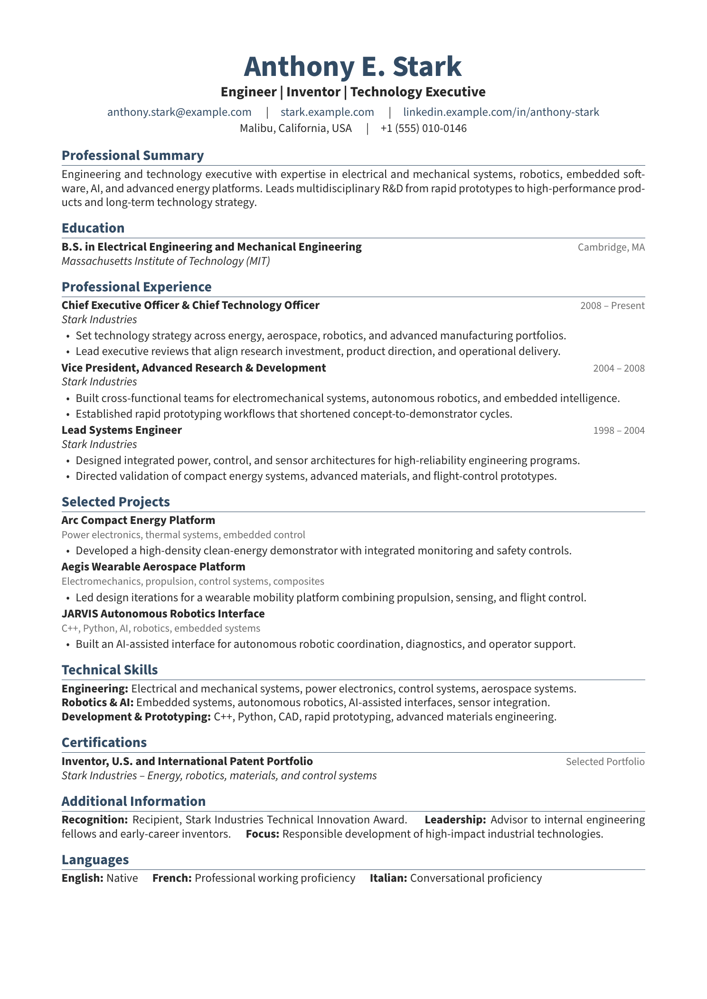
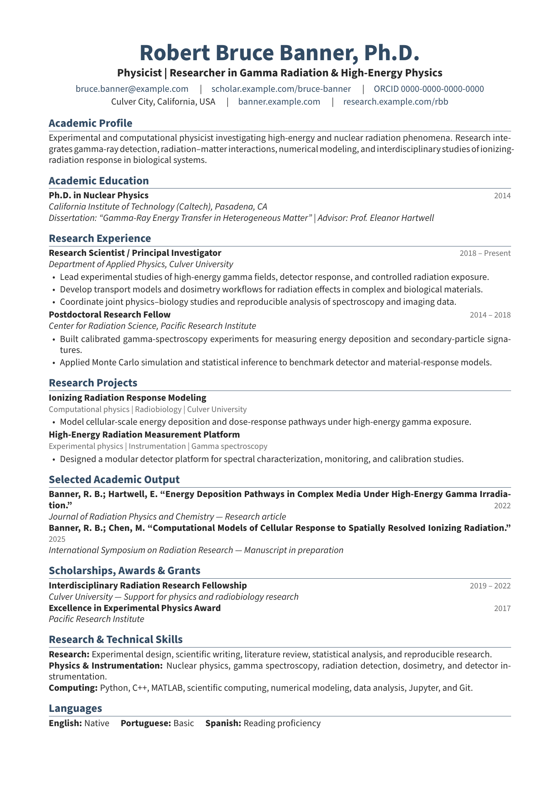

# LaTeX Templates

A small collection of LaTeX templates for CVs, research papers, and presentations.

## CV Templates

### Professional CV

A clean CV template for professional applications.

[Source](cv/professional) · [Download ZIP](https://github.com/marcosschlick/latex-templates/releases/latest/download/cv_professional.zip)

### Academic CV

An academic CV template for researchers, students, and faculty.

[Source](cv/academic) · [Download ZIP](https://github.com/marcosschlick/latex-templates/releases/latest/download/cv_academic.zip)

## Research Papers

Coming soon.

## Presentations

Coming soon.

## License

This repository is licensed under the MIT License.
